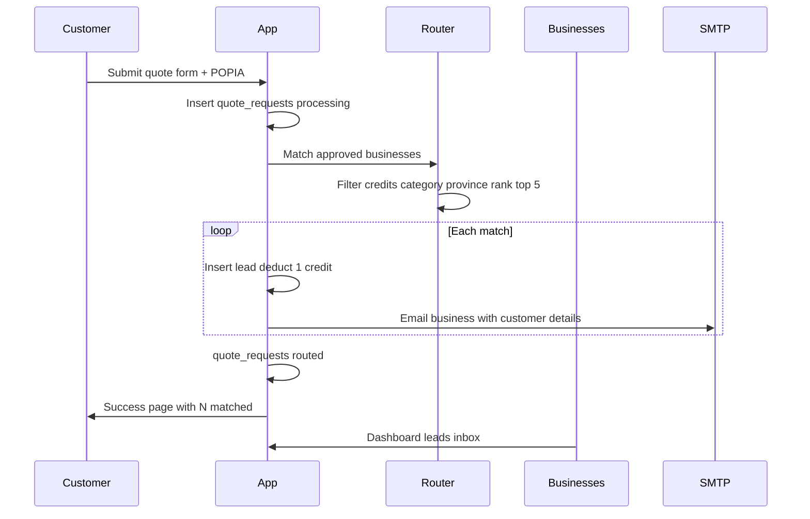

# Find My Biz — Complete Business Flows

This document describes how registration (payment + email) and Get 5 Quotes work end to end.

## Flow A: New business registers (payment + email)

```mermaid
sequenceDiagram
  participant Owner
  participant App
  participant Admin
  participant PayFast
  participant SMTP

  Owner->>App: Register (name, contact, plan)
  App->>App: Auth user + business pending free
  App->>SMTP: Admin pending + owner pending emails
  Owner->>App: Complete profile and logo
  App->>SMTP: Admin profile-updated emails
  Admin->>App: Approve listing
  App->>SMTP: Owner approved email with Pay CTA
  Note over Owner,App: Listing live on Free; paid blocked until approved
  Owner->>App: Billing upgrade
  App->>PayFast: Checkout form
  PayFast->>App: ITN COMPLETE
  App->>App: Set paid tier and monthly credits
  App->>SMTP: Admin + owner payment success
```

### Step 1 — Register (`/register`)

- Form: business name, contact person, phone, email, password, chosen plan.
- Creates:
  - Supabase auth user
  - `profiles` (then set to `business_owner`)
  - `businesses` with `status: pending`, `membership_tier: free`, `intended_membership_tier: <chosen plan>`
- Emails (`src/lib/email/registration-notifications.ts`):
  - **Admin** (`info@` / `ADMIN_APPROVAL_EMAIL`): new pending registration
  - **Owner**: complete your profile for approval
- Redirect: `/dashboard/profile`

### Step 2 — Complete profile (required before approval)

Owner fills description, phone, email, province, city, category, logo in `/dashboard/profile`.

- Rules in `src/lib/business/profile-readiness.ts`
- Optional docs (proof of address + ID) only needed for **Verified** badge
- Profile updates notify admin by email
- **Not public yet**; **cannot pay for a subscription yet**

### Step 3 — Admin approves (`/admin/businesses`)

- Approve or Verified & Approve via `src/app/api/admin/businesses/[id]/route.ts`
- Sets `status: approved` (and `is_verified` if verified path)
- Free lead credits initialized to **1/month**
- Email to owner: listing approved + **Pay now** link if they chose a paid plan
- Listing is live on the **Free** plan until payment succeeds

### Step 4 — Payment (PayFast)

- Owner opens `/dashboard/billing` → Upgrade
- `/api/payments/initiate`: only if `status === approved`; amount from server plan price; creates `payments` pending row; returns PayFast form
- Browser posts to PayFast; ITN hits `/api/webhooks/payfast`

On **COMPLETE** (first payment):

- `membership_tier` → paid plan
- Subscription active + PayFast token
- Lead credits reset to plan monthly allocation (3 / 10 / 20)
- Enterprise → `is_featured`
- Emails: admin + owner payment success

On **FAILED/CANCELLED**: payment failed; active subs downgraded to free; owner notified.

Renewals: later COMPLETE ITNs extend period and reset monthly credits (no success email).

Cancel: owner can cancel from Billing → PayFast cancel API → back to Free.

---

## Flow B: Someone requests a quotation (Get 5 Quotes)



### Step 1 — Customer form (`/get-quotes`)

- Fields: name, phone, email, province, city, category, description, optional budget
- POPIA checkbox required (consent to share contact with matched businesses)
- POST `/api/quotes`

### Step 2 — Create request + find matches

- Insert `quote_requests` (`status: processing`)
- Log search analytics (`search_term: get-quotes`)
- Load **approved** businesses in that province
- `routeLeadsToBusinesses` (`src/lib/lead-router.ts`) keeps businesses that:
  - Have **lead credits > 0**
  - Offer the **category**
  - Are in the **province**
- Rank by: membership tier → same city → Local Champion → response rate → BizTrust
- Take up to **5**

### Step 3 — Deliver leads

For each matched business:

1. Insert `leads` (`status: new`, credit deducted)
2. Deduct 1 credit from wallet
3. Email business (`src/lib/email/lead-notification.ts`) from `leads@` with customer details + WhatsApp/dashboard CTAs

Then set `quote_requests.status = routed`.

### Step 4 — Outcomes

- **Customer:** `/get-quotes/success?leads=N` — no customer email
- **Business:** sees lead in `/dashboard/leads` (new) and `/dashboard/leads/received` (history); can mark as read

If zero businesses have credits/category match, customer still gets success with `leads=0` and no emails go out.

---

## Email map (who gets what)

| Event | To |
|-------|-----|
| New registration | Admin + Owner |
| Profile updated (pending) | Admin |
| Approved | Owner (with pay CTA if paid plan chosen) |
| Subscription paid | Admin + Owner |
| Payment failed/cancelled | Owner |
| New quote lead | Matched businesses only |

SMTP sends as `leads@findmybiz.co.za`; admin ops go to `info@findmybiz.co.za`.

---

## Practical checklist

1. Register a test business with Starter → confirm admin + owner emails
2. Complete profile + logo → approve in Admin
3. Pay in sandbox (or Free stays on 1 lead) → confirm tier/credits + payment emails
4. Submit Get 5 Quotes in that province/category → business gets lead email + dashboard lead
